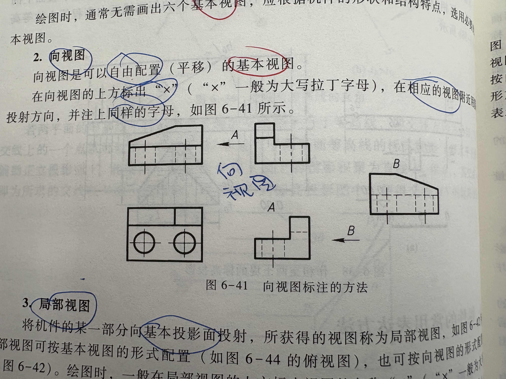
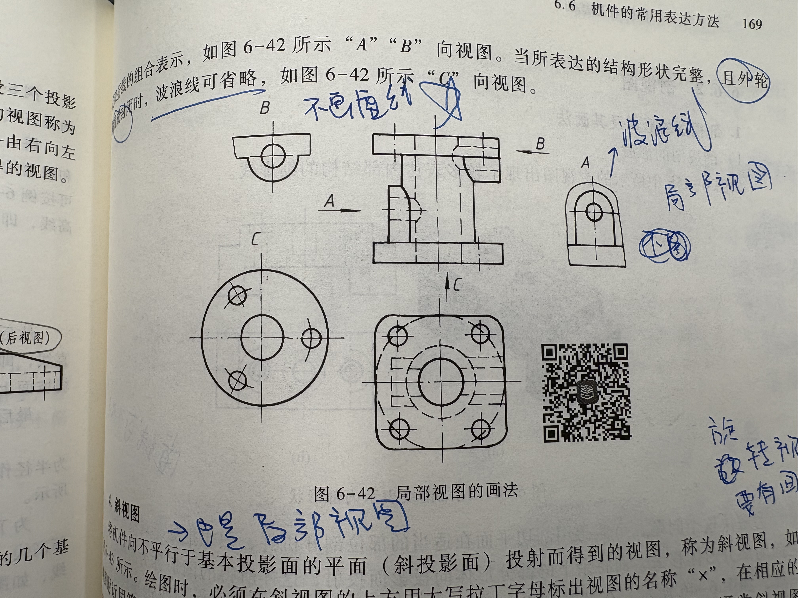
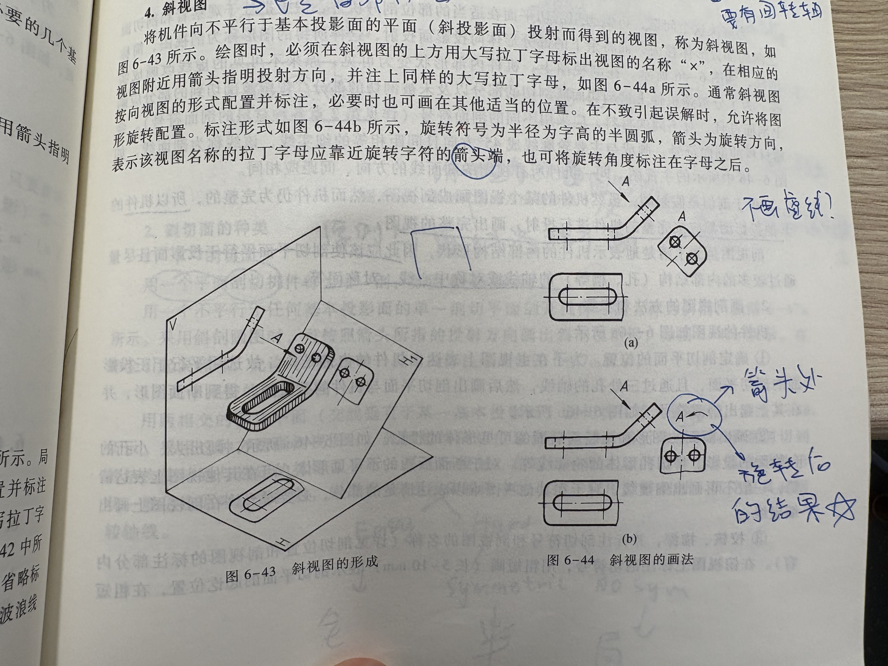

# 各类视图

## 1. 基本视图
**左视图，右视图，俯视图，仰视图，主视图，后视图**
这六个就是在**六个基本投影面**上进行投影之后得出的**六个基本视图**

## 2. 向视图
在看的方向添加一个箭头表示视角，并在对应的向视图上标注这个字母。
**向视图是需要画其中的虚线的**

## 3. 局部视图
与向视图的标注标准大致是相同的，不同之处在于要用波浪线区分出不用画的部分。只用画一小部分就可以了
**不用画虚线！！**
**但是要注意！**在外轮廓线已经封闭的时候就**不用再使用波浪线符号**来表示分隔。
如果**外轮廓线没有封闭**，那么我们需要波浪线来进行分割。
**注意，不用再往后画了！！后面的虚线是完全不需要画出来的部分**

## 4. 斜视图
**可以将斜视图也理解为局部视图的一种**，这种视图同样需要标注字母。
注意其倾斜的角度相当于将其投影面**在不颠倒方向的前提下翻折到正投影面上**的结果
如果需要转过来，箭头指向字母。

## 5. 剖视图
### ！！在剖视图中**虚线可以不画(除非是表现图形特征所必需的)**！
不可以在空气中出现断离边界线，实体中才会有边界线，如果上下有实体的话也可以。
一整个剖面图都不用画虚线，无论剖切的程度是什么
**注意，较薄的肋板不用剖**
**如果是局部剖视图，那么应该要选择能够尽可能地展现原立体形象特征的剖切方法**
比如说在有相切终止线的地方，我们可以尽量选用能够把这条线给显示出来的剖切方法。
总而言之，局部剖视要尽可能多地展现原图形的特征。
注意同一个材料的剖面符号应该是一样的，无论视图是否一样
螺纹的终止线在剖视图中是看不到的。
但是螺纹的牙顶与牙底无论是否剖视都可以看得见

## 6. 断面图

### 移出断面图
**只有孔的地方才需要作剖切视图处理**，其余没有孔的地方不需要作剖切处理。
移出断面的轮廓线应该用**粗实线**绘制
**剖面图大多数情况下只画出剖切的部分，不用画出在平面后的部分**
断面图多用于描绘有轴的地方。
**非常重要！** 如果剖切平面通过回转面形成的孔或者凹坑的轴线时，这些结构要按照**剖视图**绘制（要画出后面的部分）**要不然图形会断开！**
断面图不能够出现分立的两个图像
所以这里注意两个条件：**1. 经过孔轴线 2. 断面发生了分离 3.只对单一部分进行剖视处理**

### 重合断面图
断面图重合在原有的轮廓上，轮廓线用**细实线**绘制即可。

## 7. 局部放大图（视图比例）
应该注意这里的比例也是**图上比实际**，**不是图上的比原图！！**
这里的比例是和**图形的总体比例标注**是一样的，都是**图上的比实际的**，
**如何记忆呢？** 只要记住，比值越大，这个图形就会越大！

## 8. 简化画法
就是在那些被剖切的肋板处**省略剖面符号的行为**就叫做简化画法。
零件图中的移出断面允许省略剖面符号，但剖切位置与断面图的标注必须要按原来的规定进行标注
如果有直径相同而且成规律分布的孔，可以只画出其中的一个或者几个，其余的只用表示出中心的位置再用数字注明孔的总数即可
如果有圆或者其他的图形在一个圆上或者一条直线上均匀分布，那么我们可以在尾部加注$EQS$来表示均匀分布。
对称机件的视图可以画成一半或者1/4， 并在对称中心线的两端画出两条垂直的平行细实线
小圆角，小倒角允许省略不画，但是必须要在视图中注明尺寸或者在技术要求中加以说明。