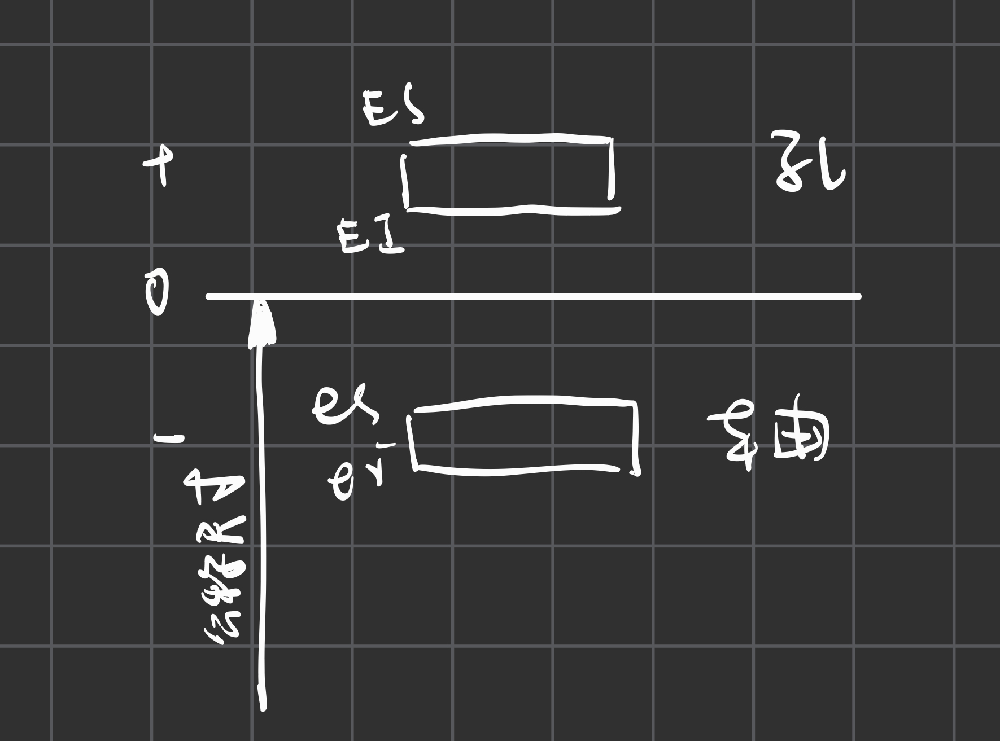
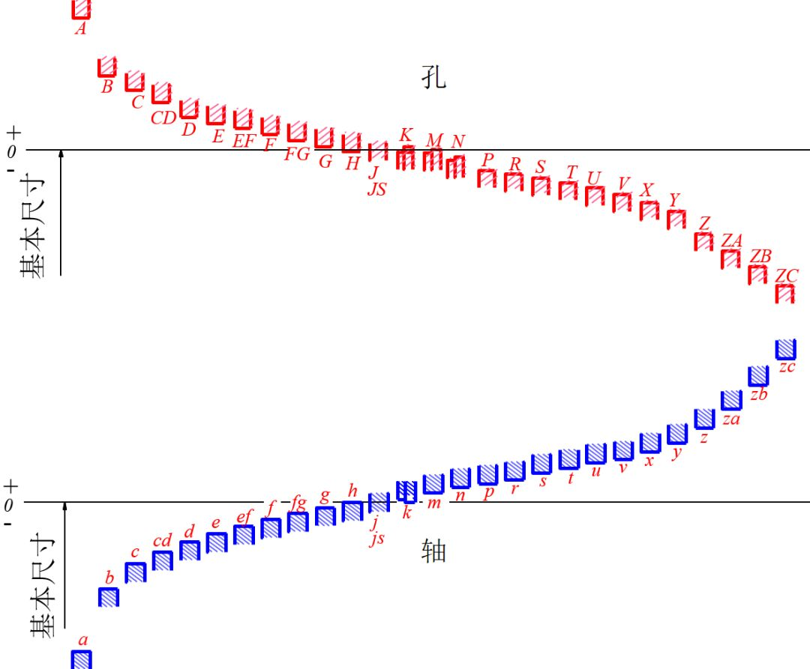
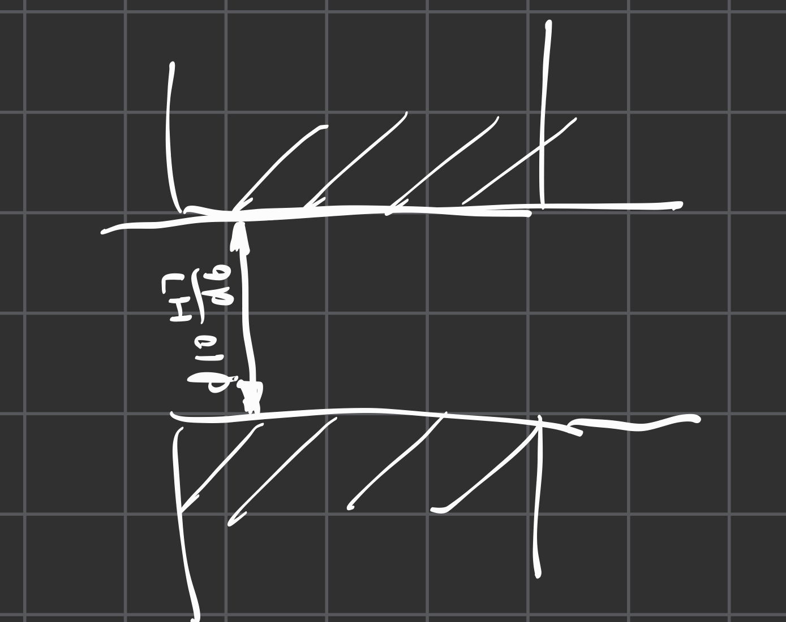
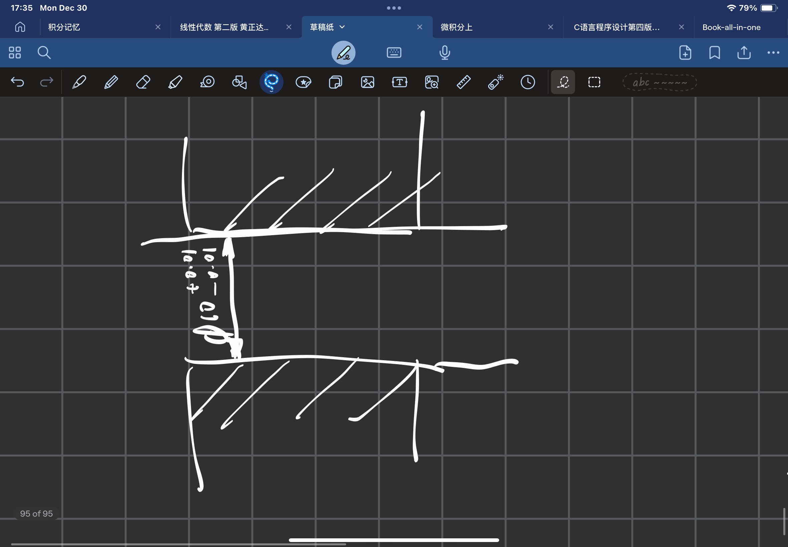
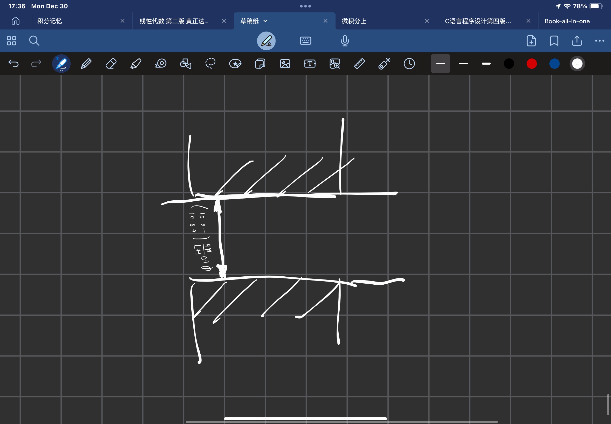

# 极限与配合与几何公差

## 1. 基本概念

### 1. 尺寸偏差（简称偏差）
- 上极限偏差 = 上极限尺寸 - 公称尺寸
- 下极限偏差 = 下极限尺寸 - 公称尺寸（这个值是负数哦！）

### 2. 尺寸公差（简称公差）
- 公差就是允许尺寸的变化量
- 公差 = 上极限尺寸 - 下极限尺寸

### 3. 尺寸公差带
- 表示公差范围与相对零线位置的一个区域
- 先画一条零线，再用一个长方形来表示**公差的范围**
- 注意在最左侧需要标注标准尺寸的值哦！
- 如果是孔公差带就用大写字母ES EI, 轴则用es, ei来表示**上极限偏差与下极限偏差**

## 2. 标准公差与基本偏差

### 1. 标准公差
- 通过IT + 数字来表示
- 公差体现的是公差带的**大小**
- 也就是体现了我们前文所提到的**公差**这个概念

### 2. 基本偏差
- 确定的是公差带的位置 
- 这个值可以是上极限偏差，也可以是下极限偏差，取决于**哪一个极限距离零线更近**！
- 若公差带在零线的上方，则标注下极限公差，反之相反

- 这个是**基本偏差系列图**
- 我们要注意的是**孔在上面**，**轴在下面**。h分别是刚好贴贴到公称尺寸的地方
- js是平均分的点
- 注意若都取H，h则应该是间隙配合
- 在j或js右边的，采取的**上极限偏差或者下极限偏差的参考点都会发生变化**， 也就是说这里是上极限偏差与下极限偏差的**转换点**
- 字母后面的数字就是公差等级

## 3. 配合

### 1. 配合的种类
- **间隙配合**的意思是公差带完全没有接触
- **过渡配合**是两个公差带有所交叉
- **过盈配合**是孔的公差带完全在轴的公差带的下方

### 2. 基准
- 如果说是大H则是基孔制
- 如果说是小h则是基轴制

### 3. 配合代号
- **基本偏差代号(字母)+ 公差等级(数字)**
- **分子上的是孔，是大写，分母上的是轴，是小写**
- 就记住上大写下小写即可！！！
- 在最前面标注公称尺寸，在后面标注公差具体数据
- 例如：φ25 H7/g6  后面的数字就是具体的公差等级（**标准公差**）的数据

### 4. 公差与配合在图样上的标注
- 在接触的地方进行标注即可，有多重标注方式
- 一种是只标注公差带代号

- 另一种是只标注上下极限偏差的数值

- 还有一种是一起标注（如果一起标注的话要把极限数值打个括号放在最后）
