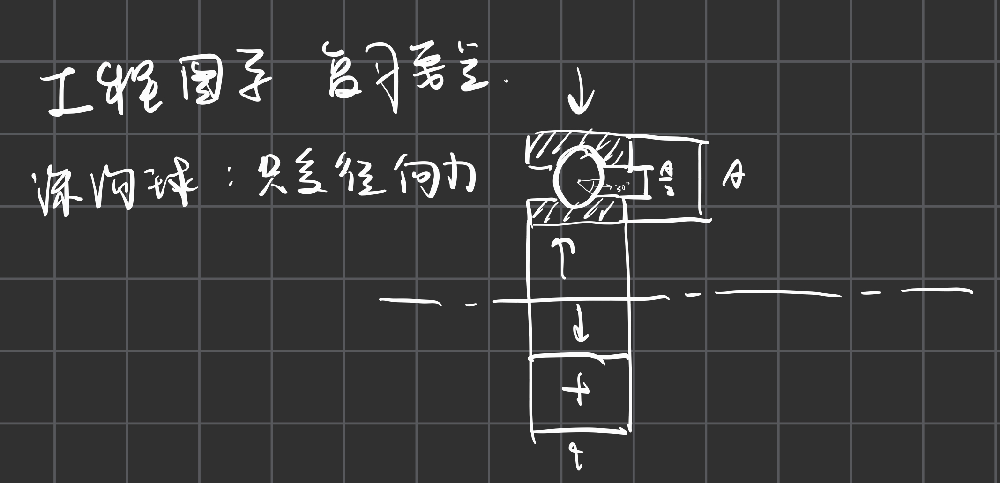
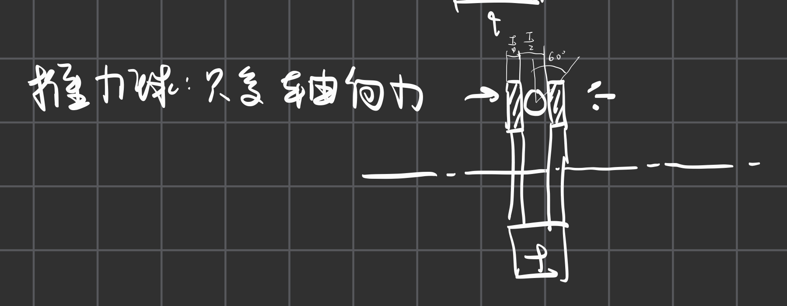
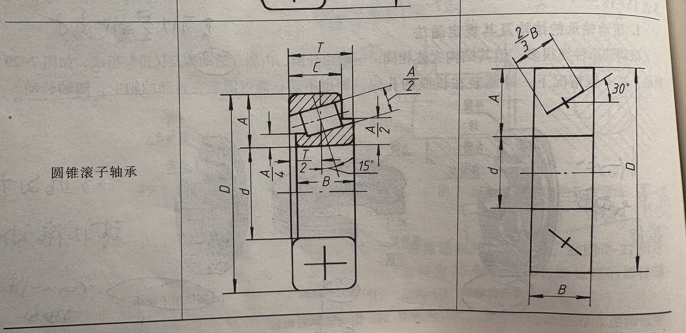

# 滚动轴承

## 1. 滚动轴承的分类

### 1.1 深沟球轴承

- 注意圆与下面形成的角度是30°
- 其受力特征为只能受**径向方向的力**，不能接受轴（图中标出的中心线的方向）向的力

### 1.2 推力球轴承

- 注意这里中间的部分也是镂空的，因为只有左右两层。
- 注意这里的球与两侧的板是**相切的**， 与前面的深沟球不同，这里的球并没有嵌进去。
- 注意这里的角度是标到边缘的角的角度是60°
- 其受力特征为**只能受轴向方向的力**，不能够受径向方向的力。

### 1.3 圆锥滚子轴承 

- 这里需要注意的是他可以受单侧的轴向力，这个由滚子的倾斜方向决定，当然这里也可以受径向力。

## 2. 滚动轴承的代号
- 四位代码体系
- 第一个数字代表了轴承的类型，6代表深沟球轴承，5代表推力球轴承，3代表圆锥滚子轴承
- 第二位数字代表的是尺寸系列，后两位数字代表的是内径代号，可以通过查表而得。