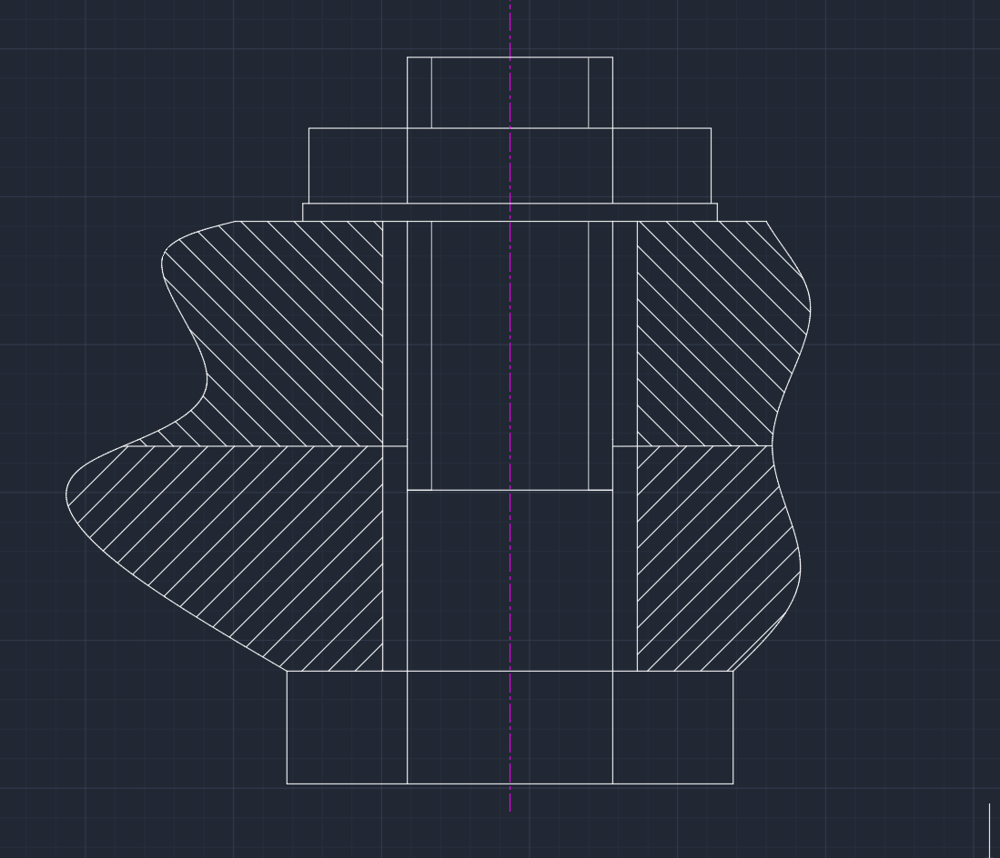
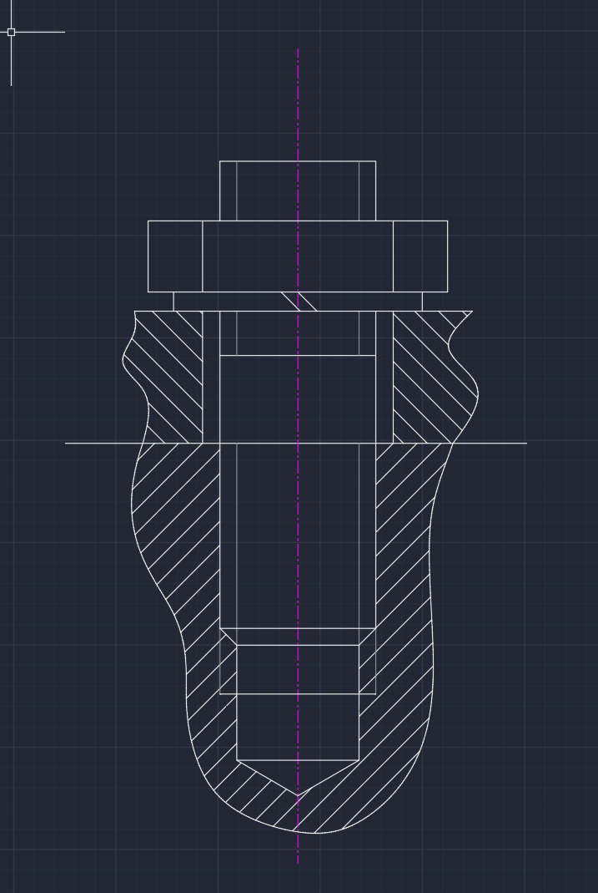
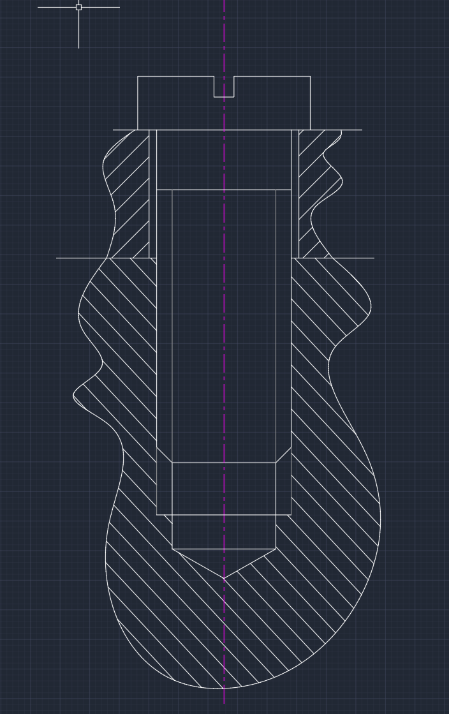
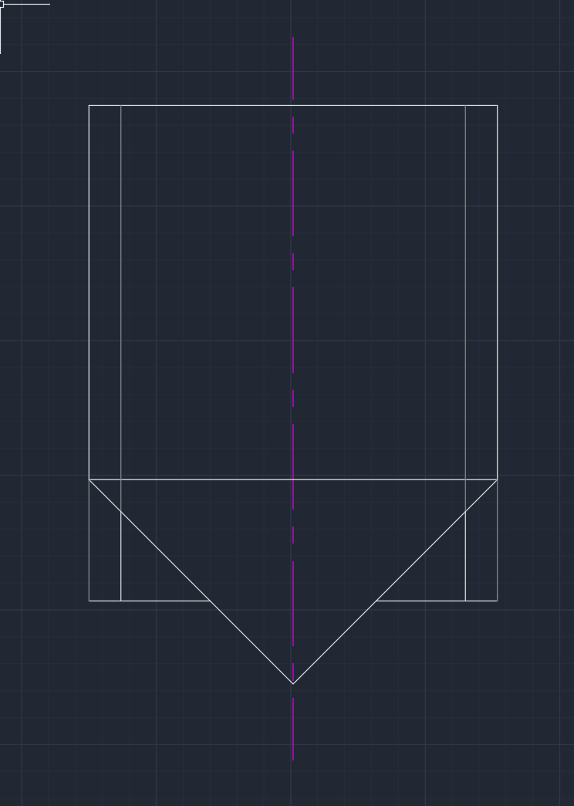

# 螺纹与螺纹紧固件

## 1. 螺纹的五要素

### 1. 牙形
分为粗牙与细牙。**需要注意这个与螺纹的标注是有关系的（有没有x2之类）**
**牙顶**就是我们可以摸得到的部分，牙底相反。

### 2. 公称直径
**公称直径不一定是大径！！！**
管螺纹的公称直径是**孔径**
- 其余的公称直径都是大径。
需要注意的是，还有一个叫做“中径“的概念，意思是在牙型上沟槽和凸起宽度相等的地方的直径。

### 3. 线数n（注意其与螺距导程的关系）
螺旋线的条数，注意这个也与后续的尺寸标注有关系

### 4. 螺距与导程
**螺距**就是相邻的两牙之间的距离，他们**不一定要在同一条螺旋线上**
**导程**是在同一螺旋线上相邻两牙之间的距离

### 5. 旋向
就是旋进去所需要的方向->右手螺旋就是右旋，左手螺旋就是左旋

### 6. 公差带代号
这里要注意，如果顶径和中径的公差带代号不同，则中径公差带在前，顶径公差带在后。表达的形式会类似于M10-5g6g
- 如果是中等旋合长度则可以**省略公差带代号的标注。**
意思就是中径的公差带代号为5g，顶径的公差带代号为6g（**顶径指的是到牙顶的直径**）

## 2. 螺纹的规定画法

### 1. 内外螺纹的规定画法

#### 1. 外螺纹
**非圆视图中**倒角的部分一定要画出来 大径要画成粗实线
注意牙底部分要画到底，不能仅仅画到倒角的部分，但是请注意这是细实线。
在**圆视图**中要注意，倒角圆不用画！但是小径是要画的，只用细实线画3/4个圆即可。

#### 2. 内螺纹
小径大径的粗细实线相反，只要注意螺纹终止线要画成**粗实线**
注意，这里的剖面符号要**画到粗实线**部分，也就是说在大径到小径之间是有剖面符号的。

#### 3. 内外螺纹的相接
**非常重要！！！**
重叠的部分以外螺纹为准。
粗实线与细实线分别对齐即可。

## 3. 常用螺纹的标注 **非常重要！！**

### 1. 普通螺纹
特征代号是M，后面直接跟数字。
比如说M24 与M24 × 2 这里我们一定要注意，只要是后面有**“×数字”**这个格式的，就是**细牙**螺纹，如果没有那么就是**粗牙**螺纹。后面×的数字就是螺距，因为细牙螺纹有许多种标准，所以要再次注明。
螺纹标记例如说M14×1-7H-L-LH的意思就是大径为14，螺距为1（细牙），公差带代号为7H， LH为左旋（**若是右旋则可以省略**）

### 2. 管螺纹
**如果没有特别说明那就直接标G就好了**
例如公称直径为1/2英寸的管螺纹标注为G1/2即可
这是采用英寸制的，**若是55°非密封** 的，则尺寸代号为G    若是55°密封的，那么根据圆柱内管螺纹，圆锥内管螺纹与圆锥外管螺纹分别是Rp, Rc, R 如果是**左旋**，那么应该加注LH。
尺寸代号应该直接在后面进行注明。

### 3. 梯形螺纹

#### 1. 特征代号
Tr 就是特征代号，如果是单线，那么直接标注，与普通螺纹相同。但是如果是多线，那么要标注成Tr40×14(P7)LH P后的数字是螺距（Pitch）那么显然此时的线数为2
**前大后小** ->前面标注导程，后面标注螺距。

### 4. 锯齿形螺纹
特征代号为B， 标注格式与梯形螺纹是相同的。

## 4. 螺纹紧固件

### 1. 螺栓（与螺母，垫圈）
- **注意点如下**
- 上下两种材料的剖面符号应该要不一样。
- 螺栓必须要比孔要小一点。
- 两种材料之间的交线应该延长到与螺柱相交。
- **顶视图**应该要遵循**内螺纹**的画法（3/4圆， 不画倒角圆）。

- 注意这里的几个重点处理：
- 不同材料交界线的延长
- 螺纹起始线在下面！
- 上面的螺栓部分不用画虚线
- 注意粗实线与细实线的作用

### 2. 螺柱连接
- **注意点如下** 
- 分界面一定要对齐（螺纹结束线与两材料之间的分界线）
- 要注意孔中的内螺纹也有螺纹的，而且他的结束的地方在更下面。
- 注意上面的材料和下面的材料的孔径不一样，上面的应该是有空隙的，而下面的是紧密连接的。
- 螺柱是中间的一小段没有螺纹，上下都有螺纹。
- 上面的孔是光孔，下面的孔是螺纹孔。
- **始终注意！剖面线应该延长到粗实线的地方，而不是细实线的地方。**

- 要一直注意各种旋转体造成的平面投影是一条线！！不能忘！例如这里的下面的内螺纹与外螺纹倒角圆积聚而成的线。
- 注意在下面的部分，有两级结构，螺柱的长度没有内螺纹的长度长，内螺纹的长度没有原先钻孔的长度长。
- **注意，被夹在中间的那一块物料是完全不会与螺柱接触的，螺柱的大径与外部材料应该是完全错开的关系。** ！！
- **螺柱的受力极限要大于螺钉的受力极限**

### 3. 螺钉连接

#### 1. 连接螺钉
- 多用于不经常拆卸且受力不大的连接场合。多用于连接薄板与厚板。
- 注意在圆视图（俯视图）中，我们要把顶上的那条线画成是斜的，不能与两条中心线重合，来表达这个槽的基本特征。
- 同样要注意剖面线要碰到粗实线才会停止。
- 与螺柱相同，下半部分应该是要紧贴外部的材料的，但是螺纹分界线可以更靠上，不用和螺柱连接一样上下对齐。
- **螺纹终止线是实线哦！！！**

- 请注意各类交界圆的地方都要用粗实线！
- 注意孔上下不一定粗！
- **螺纹的长度必须要有冗余，防止不够用，所以我们的螺纹会延伸到上面的部分**
- 俯视图不需要画表示螺纹的圆形（**粗实线圆与细实线3/4圆都不用画！**）

#### 2. 紧定螺钉
- 注意紧定螺钉的直径可以比孔的直径要更大一些，意思就是紧定螺钉头部的圆锥部分可以与螺孔的终止位置相接
- 锥顶角是90°。

- 请注意图形中的圆锥孔的直径比紧定螺钉的直径要小哦！