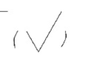

# 表面结构要求
## 1. 所有表面结构符号
第一种是就只有一个对钩，这个的意思就是可以用任何方法获得

第二种是上面是平的，意思就是必须要通过去除材料的方式获得，例如车削，铣，钻，磨等等

第三种是里面有一个圆，意思是通过不去除材料的方式获得，比如说铸造锻造冲压等等

## 2. 表面粗糙度要求
平常我们讨论的一般都是指R轮廓
Ra 3.2的意思就是Ra的上限值为3.2， 这里是遵循了16%原则，如果说是Ra max那么就是最大的值就严格不能超过3.2
Ra的数值**越小说明越光滑**，**越大说明越粗糙**
## 3. 标注方法
除了**左端面与上端面**，其他全部采用**引出标注**
左端面与上端面的标注方法与普通尺寸的标注方法是一样的
箭头的方向**必须要朝向右侧**
引出标注之后字头必须朝上
## 4. 抽象的最低要求
表面粗糙度的**最低要求**是在**括号前面**的那个

比如说在这里，如果题目问你**零件所有表面粗糙度要求最低的表面粗糙度为？**

那么就应该画上这个符号（括号前面的符号）