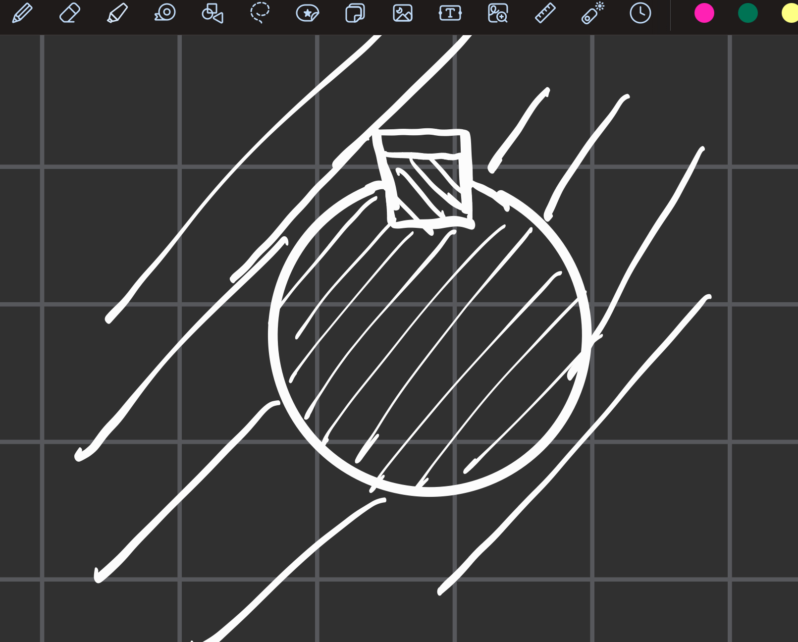

# 表面结构要求

## 1. 键

### 1.1 分类
- 普通平键共有三种情况，一种是圆头普通平键，一种是平头普通平键，还有一种是单圆头普通平键代号分别为**（A,B,C）**，其中的圆头普通平键（就是灵动岛的样子）不需要标注字母
- **这三种键都需要倒角**
- 宽度必须与槽的宽度完全相等

### 1.2 标注方式
- 尺寸标注方式为键宽×键高×键长 **!!!**
- 例如一个宽18，高11，长100的双圆头普通平键就可以标注为:键 A18×11×100 （当然其中A可以省略，但是如果是其他字母的话那就不能省略）如果没有标B没有标C那么就是默认的A型键

### 1.3 画法
- 在画组装图的时候
- 需要注意键的高度肯定顶不到最顶部的地方
- 在**非圆视图**中，**键不需要剖视**，轴局部剖视即可。
- 在**圆视图中，需要剖视**，这个时候注意**轴与键与外层的轮毂的材料都不一样，剖面线的符号都不一样即可。**!!!
- 
- 这个是**非圆视图中的键的表示法**
- 主视图中**轴与键都不用剖视哦！！**
- 
- 这个是圆视图中的表达方法，注意有**三种完全不一样的剖面符号哦！！**

## 2. 销

### 2.1 销的画图
- 注意销同样在视图中**不需要剖视**
- 要注意销两端的**倒角**哦！！
- 键虽然有倒角，但是在图画中好像不一定要明确画出来

### 2.2 销的尺寸标注
如果是圆柱销那么就先标直径，随后标公差×长度 例如一个直径10mm, 公差等级m6, 长度为60的圆柱销就可以标注为销 GB/T119.1 10 m6×60

