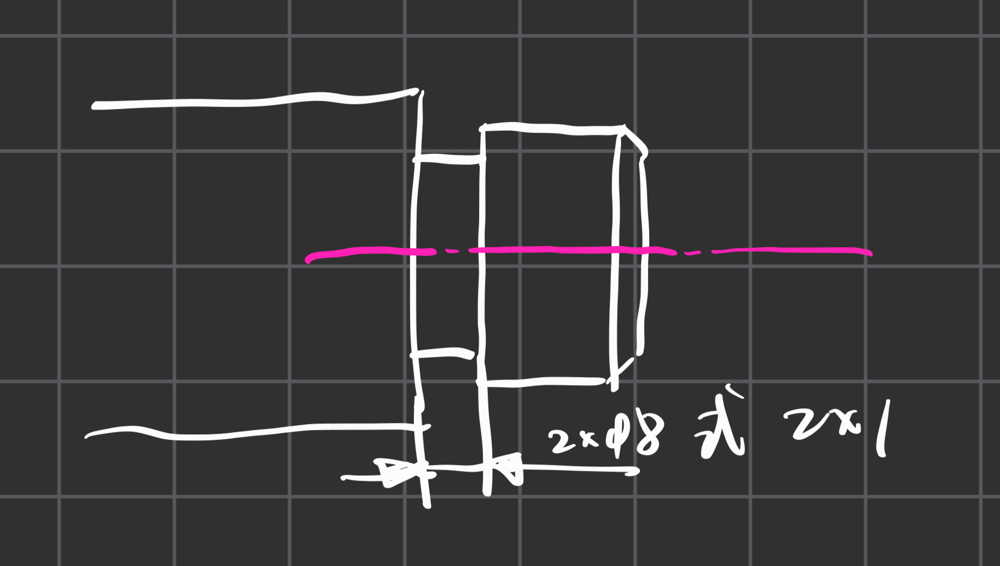

# 零件工艺结构简介

## 1. 铸造圆角
- 各个转角都应该做成**圆角**->防止金属冷却时产生缩孔与裂纹

## 2. 铸模厚度
- 铸件应该要保持厚度尽量一致，如果不一样也应该要采取**逐渐过渡**的方法
- 这样可以防止出现缩孔与裂纹

---

## 3. 起模斜度
- 应该要让零件的毛胚有一定的倾斜程度，这样在取出铸件的时候就会更加方便

## 4. 退刀槽
- 便于退出刀具
- 
- 有两种标注方式，第一种是标注宽度×直径，第二种是标注宽度×深度(深度是相较于实际连接的部分而言的，比如说这里是右侧的轴)

## 5. 钻孔结构
- 钻头钻孔时，要求**钻头轴线应该要尽量垂直于被钻孔的端面**，来保证钻孔的准确性与避免钻头被折断

## 6. 凸台与凹坑
- **与其他零件接触的接触面**都需要加工，设计出凸台与凹坑的目的是**减少加工的面积**，确保零件之间的接触完好