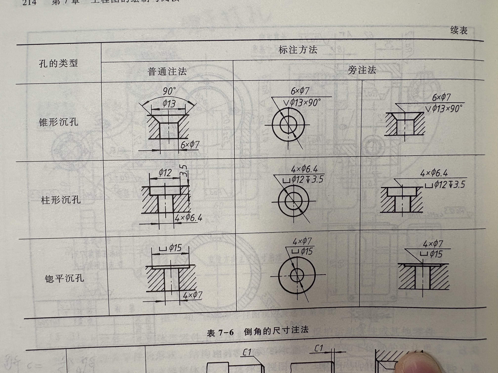

# 零件常见结构的尺寸注法

- 标一个向下的箭头就是在这里打孔的意思，如果明确标了M那么就是螺孔
- 如果说标了两个箭头旁边的数值，那么大的那个是光孔的深度，小的那个是螺孔的深度。
- 如果说是柱形沉孔也可以采用同样的标注方式，但是前面要多加特殊的符号***订书针符号***
- 如果说是锥形沉孔那么要多加一个代表整个孔的角度的尺寸标注，而且前面要有一个***V的符号***
- 锪孔也可以采用类似的标注方式，但是不用特别标注深度，因为深度很浅。

- 如果要标注倒角，***只有45°夹角才可以用C字母进行标注***，如果不是的话就不行。
- C后面的字母意思是斜边所对应的直角边的长度。