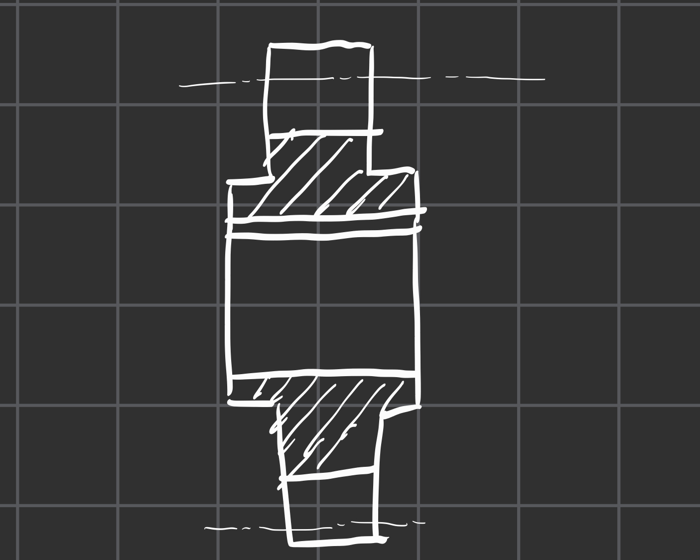
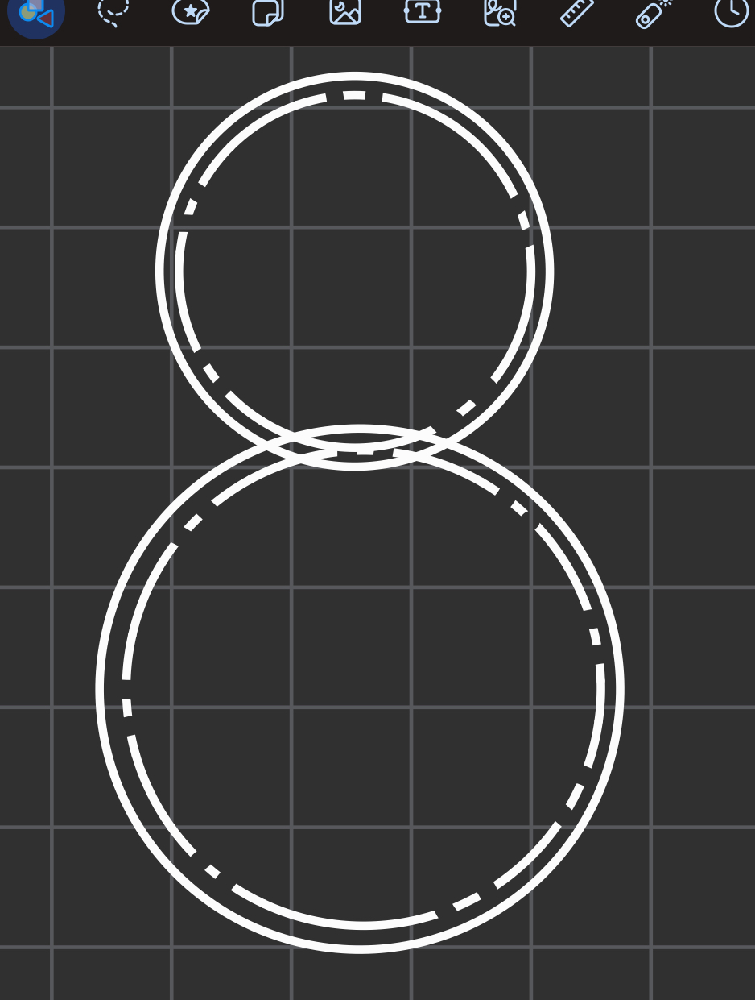
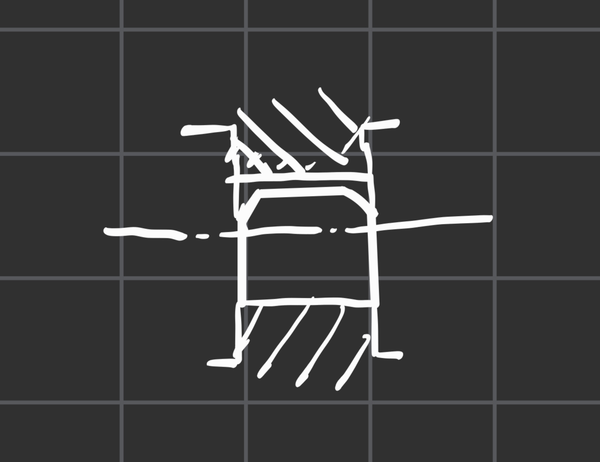

# 齿轮

# 1. 齿轮的基本参数
- 分度圆（**一般情况下使用d来进行表示**）->齿厚与槽厚相等处的圆的直径 **请注意，我们在讨论齿轮的尺寸的大多数时候都讨论的是直径** 我们标注的齿轮的参数一般都是**基于分度圆的参数进行标注的**
- **为什么要标注分度圆？** 因为这里是齿轮的齿啮合的地方（所以说在这里厚度会相同）
- 齿顶高（齿根高）指的是齿顶圆或者齿根圆与分度圆之间的径向距离，在这里应该注意齿根高必然会高于齿顶高，（要保证不会被顶到）
- 应该满足齿顶高 = 1 × m ， 齿底高= 1.25 × m
- 齿宽的意思是齿轮在轴向上的长度，而齿厚的意思是每一个齿的厚度（想象一下，反正是另一个值）
- 模数 m 应该满足d = mz ，其中d是分度圆的直径，z是一个齿轮的轮齿总数

## 我们应该要注意到：
一般的情况下我们讨论的都是圆柱齿轮中的直齿，还有**斜齿与人形齿** 使我们平常一般不会进行讨论的，而这几种齿轮也都全部属于**平行传动** 由圆锥齿轮可以实现不平行的传动。

# 2. 圆柱齿轮的画法

## 注意线型：

### 在画单一一个齿轮的时候：
- 齿顶圆与齿顶线都要用**粗实线**
- 分度圆要用**细点画线**
- 齿根圆要用**细实线**(也可以不画)**但是注意在画剖视图的时候是要画成粗实线，这样才能停止剖面线**
- 在剖视图中要注意把键槽的空隙给留出来
- 剖面符号只画到齿根的部分，注意长度比例1 : 1.25

### 在画两个齿轮的组合视图的时候
- **圆视图**：
- 分度圆相切！！这是最重要的，我们可以选择画或者不画相重叠的地方
- 齿根圆可以不画
- 
- **非圆视图**
- 注意齿根线与齿顶线之间存在空隙（0.25m）
- 可以选择不画另一边的齿，这样会更加简洁。
- 注意，**两个齿轮的材质是不一样的哦！** 所以也就是说我们要注意两侧的剖面线的方向应该是不一样的

- 注意这里相连接的地方，上下之间会存在0.25m的空隙