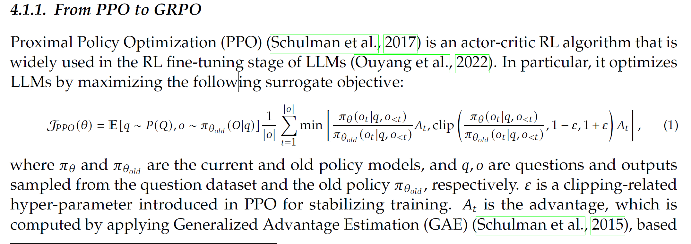
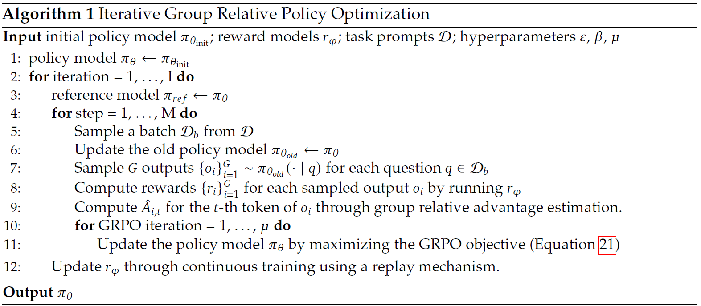

# DeepSeek-r1
- 强化学习中的***监督微调(Supervised Fine-Tuning)*** 指的是在预训练模型的基础上使用标注好的数据进行进一步的训练。SFT通常用于初始化一个模型，需要大量的标注数据，其中包含了输入与对应的正确输出。
- RL能够增强推理的能力（在SFT之后进行RL Reasoning）
- 采用GRPO， 基于PPO得来

- 这里的$A_t$指的是Advantage Function，前面的两项就是对策略进行更新的梯度，进行梯度上升的算法，限制梯度的大小。
- 广义优势估计(Generalized Advantage Estimation)指的是一种用于估计优势函数的方法，结合了蒙特卡洛方法与TD方法。参数λ满足如果 λ = 0 的时候是单步TD Estimation而 λ = 1 的时候就是纯粹的MC Estimation，就是multi-step TD。

- Pseudocode for GRPO
- GRPO的要点在于使用一整组的输入输出并***基于组内的统计数据***替代了传统的***Critic模型***，采用组内数据来计算了Advantage Value而不用通过维护Value Network。
- 标准化指的是通过***奖励值减去平均值除以标准差***来统计某一个动作的相对优势。
- ***标准化***在数学上指的是使得一系列的随机变量的均值为0， 标准差为1，这样可以创造更好的Advantage Value。
- 这样的操作可以在一组内（比如说一组就是一类问题的处理方法）创造统一的衡量标准，可以增强训练的稳定性，降低计算资源的消耗。
- 文中采用了***Accuracy Rewards与Format Rewards***来对模型的输出进行评估，而并没有采用PRM方法。PRM方法就是Process Reward Model，基于每一个步骤或每一个阶段来提供奖励信号，通过每一步具体的推理来进行评估。PRM需要大量的数据，也可能会导致Reward Hacking现象（agent利用奖励函数中的缺陷来通过不正常的方式来最大化reward）。
- Majority Voting方法采用多个模型的输出，取最多人选择的输出作为最终的输出。
- ***Rejection Sampling***是一种蒙特卡洛统计方法，在原来的样本概率分布难以采样的时候，通过提议分布（一种容易采样的分布）与接受概率来决定是否要接受采样结果。
- Rejection Sampling的重点首先是提议分布要容易采样，而且要尽量与原来的目标分布较为接近。其次是要设计好接受率，意思就是被接受的候选样本的比例。
