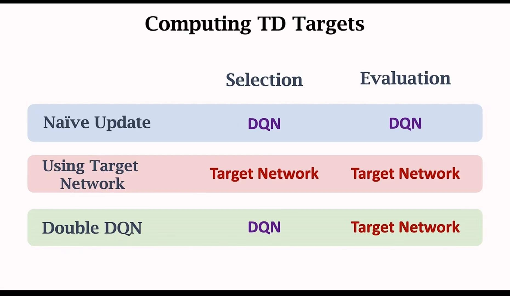

# Double DQN & Dueling DQN
## 1. Revisiting DQN
- DQN的基本思想在于让完全由神经网络预测的值根据TD算法逼近于`rt + γ*q(st+1, a)`，因为TD Target中有一部分是确定的，这样可以不断逼近于真正的结果。
- 神经网络的训练目的是使TD error的平方和的均值趋近于0
- 如果使用Online GD那么相当于是每取到一次样(s, a, r, s_{t+1})就进行一次梯度下降。用完之后这个四元组就可以丢掉。
## 2. Experience Replay
- 一个sars轨迹就是一个transition
- 将最新的transition存进容量为n的replay buffer，这个buffer是一个队列，在达到容量最大值后先进的先出 ***（请注意， n是一个超参数，一般在十万到百万之间。大小会影响训练的结果。）***
- 可以从replay buffer中随机抽取一个对拟合参数w进行SGD或者MBGD（使用平均梯度更新参数w）
## 3. Prioritized Experience Replay
- 并非所有的transition都是同等重要的。一些重要的场景需要得到更大的权重。
- 我们可以用TD Error来判定每一条transition的重要性。如果TD Error更大 ***（说明Agent对这种情况要更加不熟悉）***，就说明这条transition应该被给予更多的权重。
- 核心思想是采用importance sampling。
- TD算法采用`scaling learning rate`。如果抽样的概率大（出现的情况少），学习率会变小。
- 如果一条transition还没有被使用（没有TD Error数据），那么应该被给予最高的优先级（优先采样）。每次一条transition被使用的时候TD Error都要被更新。
- Big TD Error -> High Prob of sampling -> smaller learning rate
## 4. Bootstrapping
- 自举在统计与机器学习中非常常见。
- 在RL中自举指的是通过一个估算来对同类的数据进行另一次估算。比如说TD算法更新action value就是一种自举的方法。用自己的估计来更新自己
## 5. Problem of Overestimation
- 1. TD Target中取的是下一时刻最大的动作值，这个比实际上的Action Value要更大。
	- 数学上来看，一组数据添加均值为0的随机噪声会导致最大值更大，最小值更小。
	- 我们采用神经网络对动作价值的估计必然是不准确的，如果这个估计是无偏的（噪声之和为0），那么计算TD Target时，取到的最大action value必然会高于实际上的最大值。
- 2. Bootstrapping会导致原本的高估延续到下一次估计中，导致高估问题越来越严重。
	- 自举过程中用DQN来更新DQN自己，导致高估问题越来越严重。
- 3. 为什么高估是有害的？决策是根据动作的相对价值来决定的，如果出现了非均匀的高估，那么这种高估将会影响策略的结果。DQN的高估是non-uniform的。如果一对transition的出现越频繁，则高估的结果会更加严重
## 6. How to solve Overestimation?
### 6.1 Target Network
- 新增一个结构一样的Target Network（注意两个网络的参数应该是不一样的）
- DQN网络的作用是控制Agent与收集经验，Target Network的唯一作用是计算TD Target ***（仅计算TD Target而不用来计算原来对Q（s, a）的估计！）*** ***（使用yt = rt + γ * maxq(s, a)）*** 
- 用transition的数据来更新DQN网络的相对应参数，SGD仅用于更新DQN参数
- Target Network的数据一般使用特定步数后的DQN参数或者DQN参数与自身参数的加权平均来进行更新。
- ***应该注意到的是Target Network***并不能完全避免Overestimation的问题。只能一定程度上缓解Bootstrapping造成的高估。
### 6.2 Double DQN
- 根本在于使用DQN网络来***动作选择（实现决策）***，使用***目标网络来对yt(TD Target)进行更新。***
- 这里的 ***动作选择*** 实际上与原来的轨迹并没有关系，只是用来判定如何设置TD Target而已。因为TD Target的设定过程中需要***Q(St+1, a, w-)***
- Double DQN对Overestimation的缓解效果是最好的。

## 7. Dueling DQN
### 7.1 Revisiting Concepts
- Discounted Return: 从t时刻往后全部奖励的加权求和
- Action-Value Function: 从特定state-action-pair出发的Discounted Return的期望
- Optimal Action Value Function: 就是从s与a出发所能得到的最大return(优化变量是策略)
- Optimal State Value Function: 从s出发所能获得的最大return（优化变量也是策略）
- Optimal Advantage Function: $Q^*(s,a) - V^*(s)$ $(Q^*,V^*的意思就是最优)$。
	- 这里的后面就是Baseline。根据这里的定义，优势函数必然是非正的。
	- ***重要的Theorem:***$Q^*(s,a) = V^*(s) + A^*(s,a) - max_aA^*(s,a)$ （最后一项是0，因为***优势函数的最大值值是0***）
### 7.2 Building Dueling Network
- 与DQN的区别在于我们有一个网络拟合优势函数，输出的向量是***每一个动作的优势值***，还有一个网络用来***拟合最优状态价值函数***。
- 拟合最优状态价值网络：$V(s,w^V)$ ，后者是V神经网络参数
- 拟合优势值函数：$A(s,a,w^A)$， 后者是A神经网络参数
- 从而拟合最优动作值函数:$Q(s,a,w^A,w^V)=V(s,w^V)+A(s,a,w^A)-max_aA(s,a,w^A)$ ，能够实现与DQN相同的功能。可以使用$w来代替w^A与w^V$ 。
- Dueling Network的网络结构比原先更好。DQN相同的方法都可以用于Dueling Network，比如Double DQN, Prioritized Experience replay, multi-step TD Target.
- max项是为了可以保证唯一性，但是max项也可以替换成mean项。